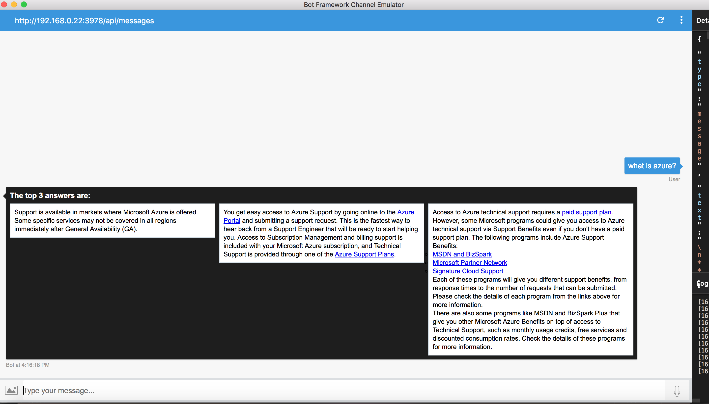

# QnA Sample

[![Deploy to Azure][Deploy Button]][Deploy Csharp/CognitiveServices-Knowledge/QnA]

[Deploy Button]: https://azuredeploy.net/deploybutton.png
[Deploy Csharp/CognitiveServices-Knowledge/QnA]: https://azuredeploy.net

## Description
QnA is a bot that helps you get answers based on FAQs. The bot uses Azure Cognitive knowledge base QnAMaker service. You can ask Azure Support questions and either get the answers to the question, or get proposed answer/question if the asked question doesn't have answers from the knowledge base.

## Bot Demo
To add the QnA demo bot to your Skype account, click [here](https://join.skype.com/bot/05ad2d2d-b847-4616-9f0a-ac9d570a9874).

## Background
Microsoft QnA Maker is a free, easy-to-use, REST API and web-based service that trains AI to response to a user's questions in a more natural, conversational way ([read more](https://docs.microsoft.com/en-us/azure/cognitive-services/qnamaker/home)).

## Create your own QnA Maker service
1. Create a knowledge base

Click [here](https://qnamaker.ai) to login into QnA Maker service website. Click "Create new service" to open the page for creating knowledge base. Fill in "service name" and "faq urls", then click "Create". (More details can be found [here](https://docs.microsoft.com/en-us/azure/cognitive-services/qnamaker/guides/createkb).)


2. Publish the knowledge base

Click "publish" button to publish your knowledge base. (More details can be found
[here](https://docs.microsoft.com/en-us/azure/cognitive-services/qnamaker/guides/createkb).)


3. Get knowledge base ID and Ocp-Apim-Subscription-Key
From "My services" -> "View code", you can find the knowledge base ID and Ocp-Apim-Subscription-Key. These info are needed when access your knowledge base.


## Build your bot: Call QnA Maker service from Microsoft bot framework project
1. The bot I will demonstrate is built in C#. The bot is fairly simple, but if you're new to Microsoft bot builder, several of the concepts might be foreign. For a quick ramp up check out [aka.ms/botcourse](http://aka.ms/botcourse), specifically the sections about setting up a C# project, using cards and using dialogs.

1. Generate answers for question:
    Build a POST request based on [QnA Maker service generate-answer API](https://westus.dev.cognitive.microsoft.com/docs/services/58994a073d9e04097c7ba6fe/operations/58994a073d9e041ad42d9ba9).

    See QnAService/Client.cs
```
    client.BaseAddress = new Uri(baseUrl);
    client.DefaultRequestHeaders.Accept.Clear();
    client.DefaultRequestHeaders.Accept.Add(new MediaTypeWithQualityHeaderValue("application/json")); //ACCEPT header
    client.DefaultRequestHeaders.Add("Ocp-Apim-Subscription-Key", subscriptionKey);

    ...

    var requestUri = $"knowledgebases/{knowledgebaseId}/generateAnswer";
    HttpRequestMessage request = new HttpRequestMessage(HttpMethod.Post, requestUri);
    var body = $"{{\"question\": \"{question}\", \"top\": \"{top}\"}}";
```

    If request succeed and answers are found in the knowledge base, then return results will be JSON of: answer, score of match. You can specify how many answers to get back in request body.

    If request succeed, but no answers found in the knowledge base, it could be:
    - Just there is no answer for that question
    - The question doesn't really have a match in knowledge base

1. Propose question and answer
    If no answers found to the question, we propose 3 most frequently ask questions, together with the answers in a carousel list:

    Build a GET http request based on [QnA Maker service download API](https://westus.dev.cognitive.microsoft.com/docs/services/58994a073d9e04097c7ba6fe/operations/58994a073d9e041ad42d9bac).

## Run locally
Set up the environment for your bot as described [here](https://docs.microsoft.com/en-us/bot-framework/dotnet/bot-builder-dotnet-quickstart). Install Visual Studio 2017 for Windows and update all extensions. Download the Bot Application, Bot Controller, and Bot Dialog templates and install it as instructed.

#### Update Config

- In Web.config file, replace values from your QnA service you created above.
```
<add key="QnABaseUrl" value="$value$"/>
<add key="QnAKnowledgeBaseId" value="$value$"/>
<add key="QnASubscriptionKey" value="$value$"/>
```

#### Usage with bot emulator

Generate answers:


Propose question/answer:


## Deploy the Bot Sample

#### Register the Sample Bot
Register the sample bot following this [link](https://docs.microsoft.com/en-us/bot-framework/portal-register-bot), and make a note of the Microsoft App ID and Password to update the configurations of your bot.

#### Update Config

- In Web.config file, replace $MicrosoftAppId$ and $MicrosoftAppPassword$ with values obtained during the bot registration from the previous step. Also, replace $BotId$ with what you want your bot Id to be. Conventionally, Bot Id is set to "28:$MicrosoftAppId$".
```
<appSettings>
    <!-- update these with your BotId, Microsoft App Id and your Microsoft App Password-->
    <add key="BotId" value="$BotId$" />
    <add key="MicrosoftAppId" value="$MicrosoftAppId$" />
    <add key="MicrosoftAppPassword" value="$MicrosoftAppPassword$" />
</appSettings>
```

#### Deploy to Cloud

Follow the instructions [here](https://docs.microsoft.com/en-us/bot-framework/deploy-bot-overview) to deploy the bot to Azure.


## More Information
To get more information about the Microsoft Bot Framework and the Microsoft QnA Maker, please review the following resources:
- [Bot Builder SDK for .NET](https://docs.microsoft.com/en-us/bot-framework/dotnet/bot-builder-dotnet-overview)
- [QnA Maker](https://azure.microsoft.com/en-us/services/cognitive-services/qna-maker/)
