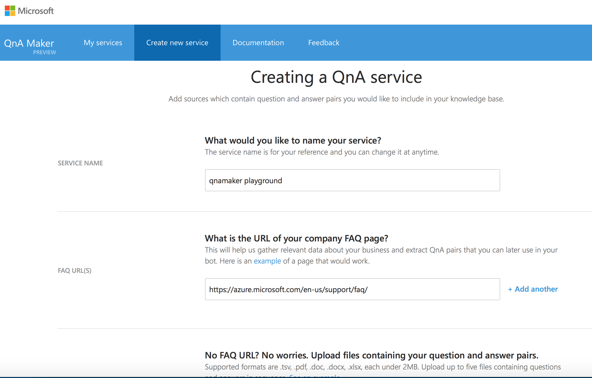
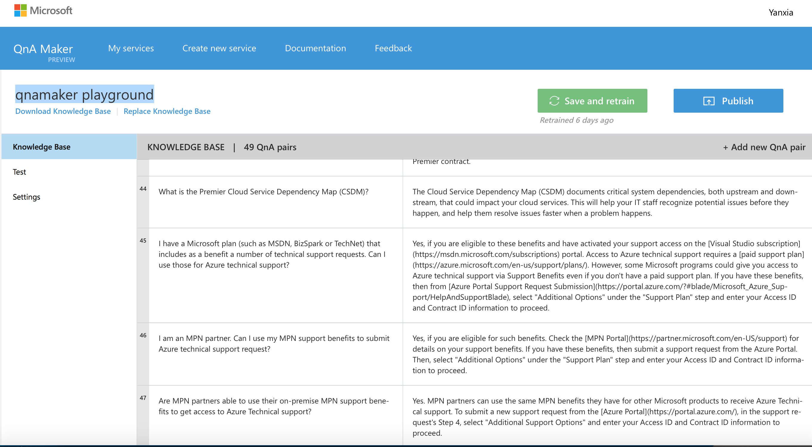
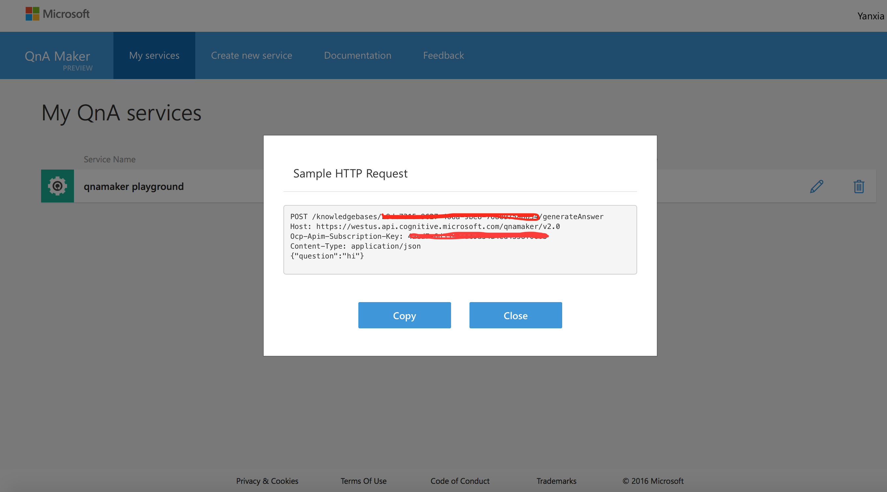
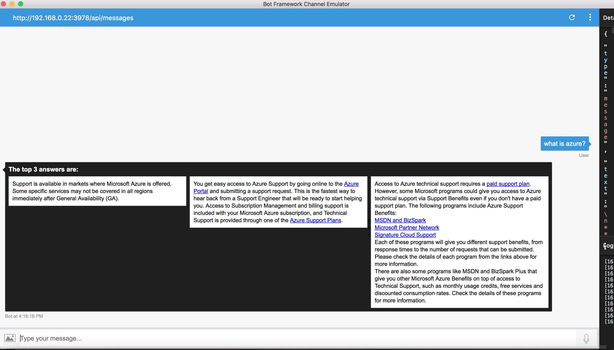
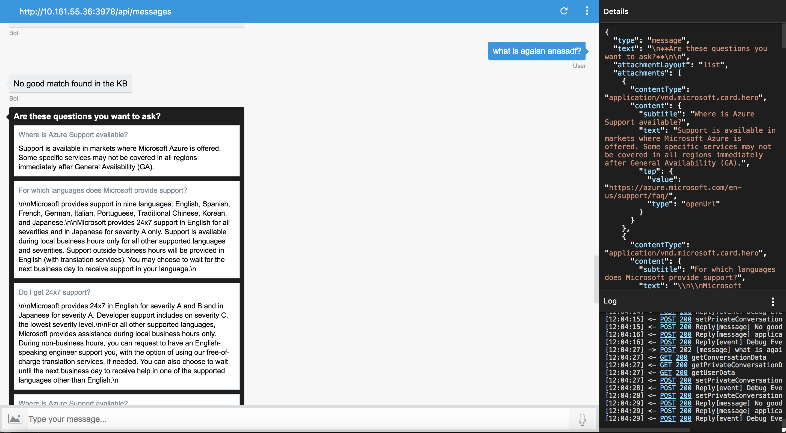

# QnA Bot Sample

## Description
QnA is a bot that helps you get answers based on FAQs. The bot uses Azure Cognitive knowledge base QnAMaker service. You can ask Azure Support questions and either get the answers to the question, or get proposed answer/question if the asked question doesn't have answers from the knowledge base.

## Bot Demo
To add the QnA demo bot to your Skype account, click [here](https://join.skype.com/bot/5cad1822-248f-4bb0-b8ae-ea5554d1ef2f).

## Background
Microsoft QnA Maker is a free, easy-to-use, REST API and web-based service that trains AI to respond to a user's questions in a more natural, conversational way ([read more](https://docs.microsoft.com/en-us/azure/cognitive-services/qnamaker/home)).

## Create your own QnA Maker service
1. Create a knowledge base

Click [here](https://qnamaker.ai) to login into QnA Maker service website. Click "Create new service" to open the page for creating knowledge base. Fill in "service name" and "faq urls", then click "Create". (More details can be found [here](https://docs.microsoft.com/en-us/azure/cognitive-services/qnamaker/guides/createkb).)



2. Publish the knowledge base

Click "publish" button to publish your knowledge base. (More details can be found
[here](https://docs.microsoft.com/en-us/azure/cognitive-services/qnamaker/guides/createkb).)



3. Get knowledge base ID and Ocp-Apim-Subscription-Key
From "My services" -> "View code", you can find the knowledge base ID and Ocp-Apim-Subscription-Key. This information is needed when accessing your knowledge base.




## Build your bot: Call QnA Maker service from Microsoft bot framework project
1. The bot I will demonstrate is built in Node.js. The bot is fairly simple, but if you're new to Microsoft bot builder, several concepts might be foreign. For a quick ramp-up check out [aka.ms/botcourse](http://aka.ms/botcourse), specifically the sections about setting up a node project, using cards and using dialogs.

1. Generate answers for question:
    Build a POST requst based on [QnA Maker service generate-answer API](https://westus.dev.cognitive.microsoft.com/docs/services/58994a073d9e04097c7ba6fe/operations/58994a073d9e041ad42d9ba9).

```
    const headers = {
        'content-type': 'application/json',
        'Ocp-Apim-Subscription-Key': process.env.OCP_API_SUBSCRIPTION_KEY
    };

    function query(question, counts) {
        return new Promise(
            (resolve, reject) => {
                let url = buildUrl() + '/generateAnswer';
                if (url && headers) {
                    const requestData = {
                        url: url,
                        headers: headers,
                        body: JSON.stringify({
                            question: question,
                            top: counts
                        })
                    };

                    request.post(requestData, (error, response, body) => {
                        if (error) {
                            reject(error);
                        } else if (response.statusCode != 200) {
                            reject(body);
                        } else {
                            resolve(body);
                        }
                    });
                } else {
                    reject('The request url or headers is not valid.');
                }
            }
        );
```
    If the request succeeds and answers are found in the knowledge base, then return results will be JSON of: answer, score of match. You can specify how many answers to return in request body.

1. Propose question and answer
    If no answers were found to the question, we propose 3 most frequently ask questions, together with the answers in a carousel:

    Build a GET http request based on [QnA Maker service download API](https://westus.dev.cognitive.microsoft.com/docs/services/58994a073d9e04097c7ba6fe/operations/58994a073d9e041ad42d9bac).

```
    function download() {
        return new Promise(
            (resolve, reject) => {
                let url = buildUrl();
                if (url && headers) {
                    const requestData = {
                        url: url,
                        headers: headers
                    };

                    request.get(requestData, (error, response, body) => {
                        if (error) {
                            reject(error);
                        } else if (response.statusCode != 200) {
                            reject(body);
                        } else {
                            resolve(body);
                        }
                    });
                } else {
                    reject('The request url or headers is not valid.');
                }
            }
        );
    }

    function buildUrl() {
        const url = process.env.QNA_SERVICE_API_URL;
        return url + process.env.KNOWLEDGE_BASE;
    }
```
## Run locally
Set up the environment for your bot as described [here](https://docs.microsoft.com/en-us/bot-framework/nodejs/bot-builder-nodejs-quickstart). Install Node.js and npm if not already installed, and install the Bot Builder SDK for Node.js and restify as instructed.

#### Update Configurations
In the .env file, add QnA Maker service API Variables including: OCP_API_SUBSCRIPTION_KEY, KNOWLEDGE_BASE and QNA_SERVICE_API_URL.
```
# QnA Maker service API Variables
OCP_API_SUBSCRIPTION_KEY='value'
KNOWLEDGE_BASE='value'
QNA_SERVICE_API_URL='https://westus.api.cognitive.microsoft.com/qnamaker/v2.0/knowledgebases/'
```

## Deploy the Bot Sample

#### Register the Sample Bot
Register the sample bot following this [link](https://docs.microsoft.com/en-us/bot-framework/portal-register-bot), and make a note of the Microsoft App ID and Password to update the configurations of your bot.

#### Update Config

- In the .env file, add values for MICROSOFT_APP_ID, and MICROSOFT_APP_PASSWORD with values obtained during the bot registration process.
```
MICROSOFT_APP_ID='value'
MICROSOFT_APP_PASSWORD='value'
```

## Test your bot

Either deploy the bot to an Azure web app and fill in the process.env variables in the portal's app Settings, or test it locally using [bot Emulator](https://aka.ms/bf-bc-emulator).

Generate answers:


propose question/answer:

